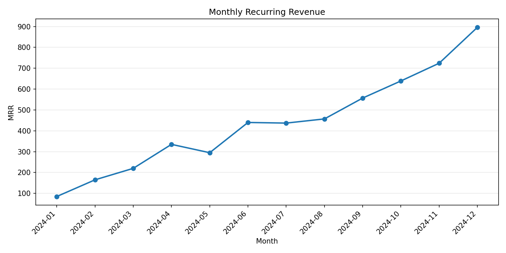
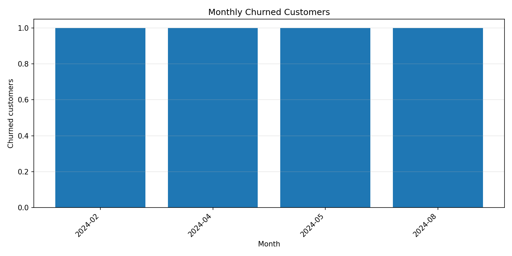
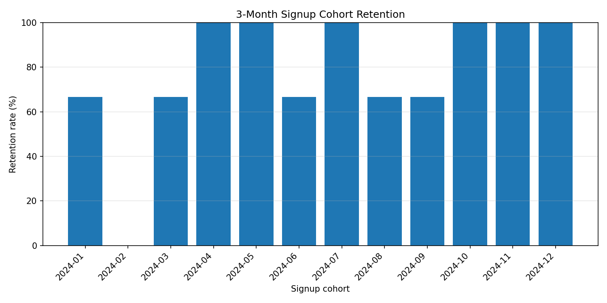

# Utilus SaaS Data Analytics

CSV analytics CLI for SaaS subscription metrics.

## Usage

Install dependencies with `uv`, then run the CLI against the input CSV files:

```bash
uv sync
uv run python main.py --help
```

Run the test suite with:

```bash
uv run pytest
```

## Bonus: Visualizations

Generate one chart per metric with:

```bash
make visualize-mrr
make visualize-churn
make visualize-retention
```

These images are committed for assignment review only. In a normal project workflow,
generated chart artifacts would be left out of git and regenerated as needed.







## Documentation

See [DESIGN.md](DESIGN.md) for the code structure, metric rules, data-quality behavior,
and implementation trade-offs.

Codex conversation exports for this repository are available in
[codex-sessions/](codex-sessions/). Open `codex-sessions/index.html` to browse them.
